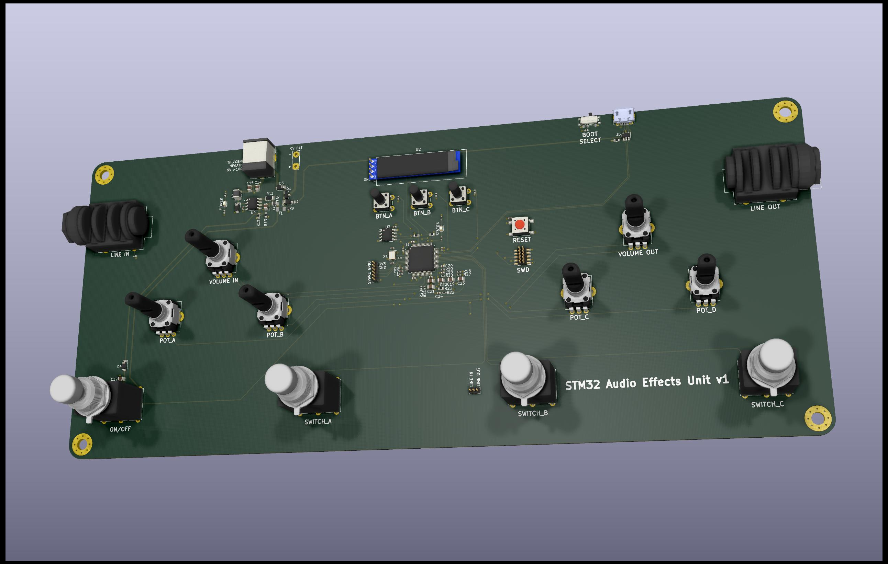

# STM32 Audio Effects Unit



Embedded STM32 audio effects project with fixed-point DSP in C, host-side effect demo tooling, and board design files.

Includes overdrive/echo/compression DSP in C, STM32 firmware with FreeRTOS + DMA audio I/O, a Python host demo, and KiCad/LTspice hardware assets.

## Repository Layout

- [dsp](dsp): portable DSP and math code
- [firmware](firmware): STM32 target firmware
- [host](host): host-side demo tooling
- [hardware](hardware): board and analog design assets
- [tests](tests): test assets
- [docs](docs): setup, architecture, bring-up notes
- [scripts](scripts): helper scripts

## Quick Start: Host Demo

From the repository root:

```sh
./scripts/demo.sh
```

## Firmware Snapshot

Current STM32 firmware lives under [firmware/stm32f303/cubemx](firmware/stm32f303/cubemx).

- FreeRTOS task-based control flow
- ping-pong sample buffering
- DMA-driven ADC/DAC audio transfer
- effect parameter/state handling
- I2C infrastructure for peripherals (EEPROM and display path)

## Tests

Run from repository root:

```sh
./scripts/check.sh
```

Or run tests only:

```sh
./scripts/test.sh
```

Check formatting without modifying files:

```sh
./scripts/format-check.sh
```

Clean generated artifacts:

```sh
./scripts/clean.sh
```

## Hardware Snapshot

Board assets are under [hardware/STM32AudioEffects](hardware/STM32AudioEffects), with analog simulation files under [hardware/LTspice](hardware/LTspice).

## Why Fixed-Point Here

The DSP path is fixed-point by design: explicit numeric behavior, deterministic control over arithmetic, and portability to targets without strong floating-point support.
